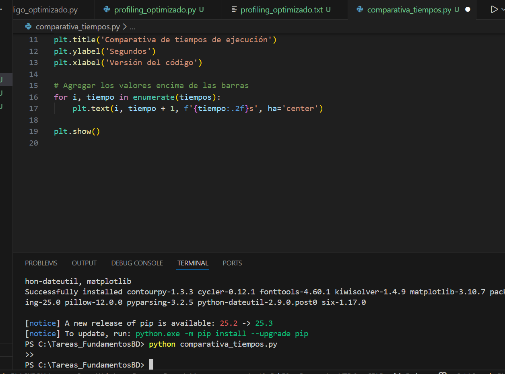
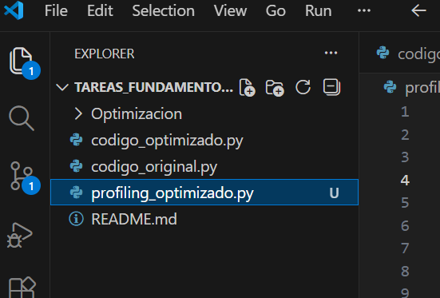

Nombre: Ana Cristina Lima MErin
Fecha:23/11/2025
Carrera:Ingenierìa en Ciencia de Datos e Inteligencia Artificial.
Periodo Académico: 2S 2025
Semestre:Tercero

Repositorio: https://github.com/AnaCristina2308/Tareas_FundamentosBD

---

# 

                AA4_Optimización de Código en Python

Introducción

El presente trabajo autonomo tuvo como proposito desarrollar un codigo original y luego optimizarlo para mejorar su rendimiento, el programa consistia en encotrar todos los numeros primos en el  rango comprendido entre 1 y 100000.
Para el codigo original se utilizon un aloritmo en donde se comprobaba la visibilidad de cada numero para evaluar todos los posibles divisores.
En este metodo se utilizaba una gran cantidad de recursos pues el tiempo de respuesta era alto.

Por esto era necesario implementar un metodo que ayude a optimizar. Es aqui en donde entran librerias de procesamiento numerico pues en el codigo original no contabamos con esto, por lo que no se podia aprobechar  la eficiencia de los modiulos cientificos que nos ofrece Python.

                    Optimización

En ambos cdigos se utilizo el modulo Time, este nos ayuda a medir en segundos la duracion total del tiempo de ejecucion del programa. Aqui se marca el tiempo de inicio y de fin por lo que luego hacen una resta para poder darnos un resultado del tiempo que tomo en ejecutar el programa.

--Coddigo Original

Tambien en la optimizacion se ocupo una raiz cuadrada con el modulo -math.sqrt- esto permitio crear un bucle que itera hasta la raiz cuadrada del numero analizado, se hace asi porque si un numero no tiene divisores <= que su raiz cuadrada se lo considera como primo, de esta manera disminuimos el numero de iteraciones y por ende el tiempo de ejecucion.

Aqui tambien fue necesario aplicar la libreria Numy esto con el fin de que los arreglos sean de forma vectorizada a traves de la funcion np.arange. Esto reduce el uso de memoria en comparacion con las listas tradicionales.

De la misma manera se tuvo que reestructurar el codigo y los bucles de tal manera que sean simplificados eliminando redundancias. Tambien se aplico una bandera boooleana "esprimo", para reducir el numero de comprobaciones, y estos numeros primos se iban almacenando en una lista.
 
 --Codigo Optimizado
 

Despues se aplico cProfile con el fin de analizar el rendimiento, aqui se mide el desempeño en cada funcion que se ocupa dentro del programa, se genera un archivo de tipo txt, y en este se registra cuantas veces se llama a cada funcin y su tiempo. Aqui se encontro que la funcion math.sqrt era la mas utilizada, y la que mas carga de procesamiento tenia era el buucle "calcular_primos".

Finalmente se realizo la visualizacion ocupando la libreria Matplotlib a traves de un grafico de barras donde se mostraro los tiempos de ejecucuon de las 2 versiones de codigo.

#Resultados

El tiempo de ejecucion del primer codigo fue de 79,09 segundos en cambio en la version optimizada solo fue de 0,56 segundos.

En el archivo profiling_oprimizado.txt se muestra qye ek numero total de llamadas de funcion fue de 109600 en 0,561 segundos, es decir, que aunque la cantidad de operaciones rralizadas son bastantes el tiempo de ejecucion mejoro y se mantuvo en los minimos.

Asi mismo el grafico que se genero con MAtplotlib se muestra una diferencia grandemente significatica entre ls codigod, las barras de color rosado es el del primer codigo y en color verde el sgundo.

ANEXOS

